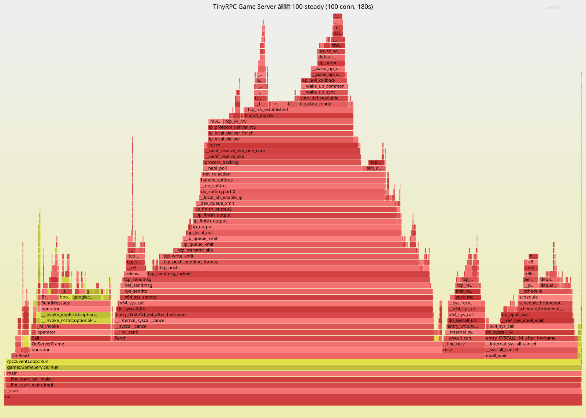
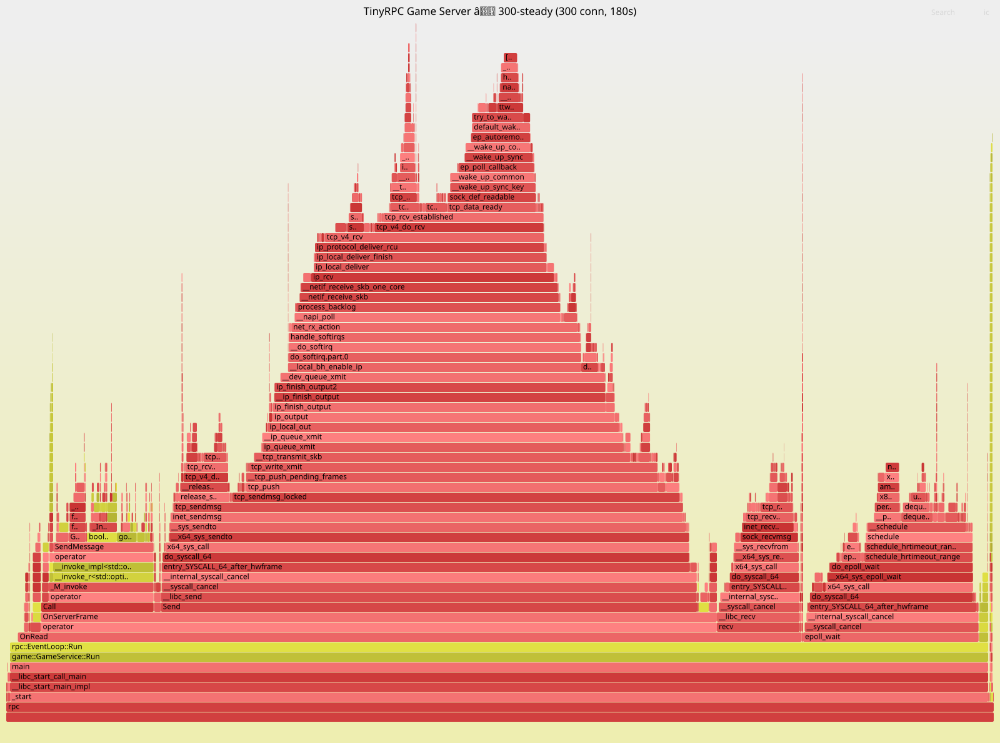
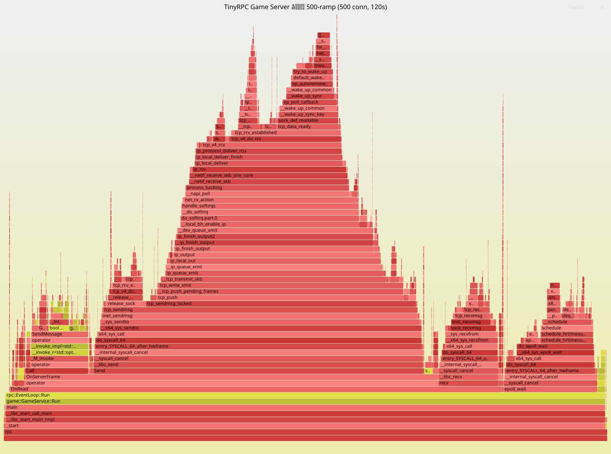

# TinyRPC

> **基于 C++20 的轻量级 RPC 框架 → 游戏服务端项目**
>
> 自研六层通信内核（TLV 序列化 / 协议帧 / epoll Reactor / 线程池 / Stub-Dispatch）之上，
> 构建完整游戏业务模块：房间管理 / 帧同步 / 匹配系统 / 会话管理 / 压测工具。
> 从零造轮子，260 项测试全部通过，ASan 全量零内存错误。

[](https://en.cppreference.com/w/cpp/20)
[](https://cmake.org/)
[](https://kernel.org)
[](https://protobuf.dev/)
[](./Dockerfile)
[](./LICENSE)
[](./tests/)
[](https://github.com/Archer11-q/tinrpc/tags)

---

## 架构总览

```
┌──────────────────────────────────────────────────────────────────┐
│                     游戏业务层  (v0.12 ✅)                        │
│                                                                  │
│  游戏协议 (v0.7)    TimerManager (v0.8)    压测工具 (v0.11)       │
│  ├─ Protobuf proto3   ├─ 小顶堆定时器       ├─ bench_game_client  │
│  └─ Login/Room/Frame  └─ Schedule/Cancel    └─ 6 种压测模式       │
│                                                                  │
│  房间服务器 (v0.8)        帧同步系统 (v0.9)    匹配系统 (v0.10)    │
│  ├─ GameRoom (状态机)     ├─ FrameSyncManager   ├─ EloCalculator  │
│  ├─ RoomManager           ├─ InputBuffer        ├─ MatchQueue     │
│  ├─ Broadcast             ├─ GameState/tickLogic├─ MatchService   │
│  ├─ RoomService (RPC)     ├─ CatchUp (追帧)     ├─ GameService    │
│  └─ EPOLLRDHUP 断连       ├─ SnapshotManager    └─ SessionManager │
│                            └─ Reconciliation                     │
│                                                                  │
│  断线重连 (v0.13 🚧)   Docker 部署 (v0.12 ✅)                      │
│  ├─ SessionManager       └─ Dockerfile + stdout 缓冲修复          │
│  ├─ 心跳 Ping/Pong                                               │
│  └─ 快照 + 批量追帧恢复                                            │
├──────────────────────────────────────────────────────────────────┤
│                    RPC 通信层  (v0.1~v0.6 ✅)                      │
│                                                                  │
│  Stub / Dispatch (v0.5)    协议帧层 (v0.2)    序列化层 (v0.1)     │
│  ├─ RpcClient (代理)       ├─ 13字节帧头       ├─ TLV 编解码      │
│  └─ Dispatch (分发)        └─ Buffer粘包/拆包   └─ Protobuf 双轨  │
│                                                                  │
│  线程池 (v0.4)              网络 IO 层 (v0.3)                     │
│  └─ 生产者-消费者            └─ epoll ET + Reactor + eventfd      │
└──────────────────────────────────────────────────────────────────┘
```

**数据流向**：客户端 `Stub Call → 序列化 → 协议帧 → send()` → 服务端 `epoll → Buffer → Decode → Dispatch → 业务逻辑 → Encode → send()`

---

## 快速开始

### 环境要求

| 工具 | 最低版本 | 实测版本 | 说明 |
|------|---------|---------|------|
| CMake | 3.16 | 4.2.3 | 构建系统 |
| GCC | 9.0 | 15.2.0 | 需 C++20（concepts/ranges/coroutines） |
| Protobuf | 3.x | 3.21.12 | `protoc` + `libprotobuf` |
| OS | Linux（推荐 WSL2） | Ubuntu 24.04 | epoll 为 Linux 专属 |

### 一键构建 & 测试

```bash
git clone git@github.com:Archer11-q/tinrpc.git
cd tinrpc
mkdir build && cd build
cmake .. && make -j$(nproc)

# 运行全部 19 个测试 target（共 260 项断言）
./test_serializer && ./test_protocol && ./test_network && ./test_thread_pool
./test_rpc && ./test_proto_vs_tlv && ./test_game_proto && ./test_timer_manager
./test_game_room && ./test_broadcast && ./test_room_events && ./test_game_e2e
./test_room_service && ./test_input_buffer && ./test_frame_sync && ./test_game_state
./test_snapshot_manager && ./test_frame_sync_flow && ./test_match_queue
```

<details>
<summary>各 target 覆盖范围</summary>

| Target | 项数 | 覆盖 |
|--------|:----:|------|
| `test_serializer` | 11 | TLV 编解码、边界/类型/长度校验 |
| `test_protocol` | 16 | 13 字节帧头、粘包/拆包 |
| `test_network` | 7 | epoll ET + Reactor 收发 |
| `test_thread_pool` | 6 | 生产者-消费者、优雅关闭 |
| `test_rpc` | 4 | Stub → Dispatch 端到端 |
| `test_proto_vs_tlv` | 4 | TLV vs Protobuf 体积/速度 |
| `test_game_proto` | 7 | 游戏协议消息正确性 |
| `test_timer_manager` | 8 | 小顶堆定时器、惰性取消 |
| `test_game_room` | 37 | 房间状态机、超时淘汰 |
| `test_broadcast` | 8 | 房间内广播 |
| `test_room_events` | 14 | 加入/离开/开始 事件通知 |
| `test_game_e2e` | 4 | 房间端到端流程 |
| `test_room_service` | 16 | RoomService RPC + 帧同步衔接 |
| `test_input_buffer` | 20 | Jitter Buffer、乱序/覆盖 |
| `test_frame_sync` | 27 | 帧号/输入收集/追帧 |
| `test_game_state` | 21 | tickLogic 确定性 + 预测/和解 |
| `test_snapshot_manager` | 17 | 环形快照、淘汰 |
| `test_frame_sync_flow` | — | 全流程模拟 + 耗时报告 |
| `test_match_queue` | 33 | ELO + 匹配队列 + 集成 |

</details>

> **注意**：跑测试前务必先 `make`。`build/` 里的二进制可能早于源码，
> 旧产物通过不代表当前代码通过（v0.12 排查追帧 bug 时就踩过这个坑）。

### ASan 内存检查

```bash
mkdir build-asan && cd build-asan
cmake .. -DCMAKE_BUILD_TYPE=Debug -DENABLE_ASAN=ON && make -j$(nproc)
./test_frame_sync && ./test_game_room && ./test_match_queue   # 或全部 19 个
```
> 2026-09 首次全量 ASan 验证：19/19 通过，零内存错误。

### 启动游戏服务器

```bash
./rpc                                    # 端口 8080，启动全部游戏模块
```

### Docker 部署

```bash
docker build -t tinrpc .
docker run -p 8080:8080 tinrpc
```

### 运行压测

```bash
# 单连接基线
./bench_game_client --mode single

# 100 并发稳态 5 分钟
./bench_game_client --mode steady --connections 100 --duration 300

# 渐进加压到 500 连接
./bench_game_client --mode ramp --connections 500 --ramp-rate 50
```

---

## 核心特性

### RPC 通信层（v0.1 ~ v0.6）

| 模块 | 版本 | 核心能力 |
|------|------|---------|
| TLV 序列化 | v0.1 | 200 行零依赖，Type-Length-Value 编码，边界/类型/长度三重校验 |
| 协议帧 | v0.2 | 13 字节帧头（魔数 0xBABE），Buffer 粘包/拆包，body 不透明 |
| 网络 IO | v0.3 | epoll ET + Reactor + eventfd，非阻塞 IO |
| 线程池 | v0.4 | 生产者-消费者模型，Frame 回调异步执行 |
| Stub/Dispatch | v0.5 | RpcClient 代理匹配请求/响应，Dispatch 方法注册表，pending 表超时 |
| Benchmark | v0.6 | RPC vs HTTP+JSON 三层对比（序列化/网络/端到端） |

### 游戏业务层（v0.7 ~ v0.11）

| 模块 | 版本 | 核心能力 |
|------|------|---------|
| 游戏协议 | v0.7 | Protobuf proto3，Login/Room/Frame/Match 等消息，TLV 与 Proto 双轨共存 |
| 房间服务器 | v0.8 | 六状态房间状态机，RoomManager CRUD，Broadcast 房间广播，RoomService RPC，EPOLLRDHUP 断连清理 |
| 帧同步系统 | v0.9 | FrameSyncManager 20fps tick，InputBuffer Jitter Buffer（deque+二分查找），确定性 tickLogic，CatchUp 2帧追帧，SnapshotManager 环形快照，Reconciliation 预测/和解 |
| 匹配系统 | v0.10 | EloCalculator K=32 评分，MatchQueue 有序 vector 二分插入+超时分差放宽，MatchService 匹配→房间→通知，GameService 集中入口 main() |
| 会话管理 | v0.10 | SessionManager 接口定义 + 断线重连方案设计文档 |
| 压测工具 | v0.11 | bench_game_client 6 种模式（single/ramp/steady/chaos/fs/match），BenchStats 直方图+分位数，ServerMetrics 实时指标 |
| 性能分析 | v0.11 | perf + FlameGraph 火焰图，3 种业务场景 ×3 个并发档位，CPU 热点精确到函数级 |
| 代码质量 | v0.12 | clang-format 统一风格，Doxygen 注释规范化 |
| Docker 部署 | v0.12 | Ubuntu 24.04 多阶段构建 + stdout 缓冲修复，一行 `docker run` 启动 |
| 断线重连 | v0.13 🚧 | SessionManager 生命周期、心跳 Ping/Pong、宽限期保留房间位置、快照+批量追帧恢复 |

---

## 压测数据（v0.11）

### 常规 RPC — 全档位容量测试（200ms think time）

| 并发连接 | 模式 | QPS | avg(μs) | p50(μs) | p95(μs) | p99(μs) | 错误率 |
|---------|------|-----|---------|---------|---------|---------|--------|
| 1（基线） | single 30s | ~5 | 628.6 | 300.0 | 383.0 | 534.0 | 0% |
| 10 | ramp 60s | ~50 | 469.4 | 314.0 | 475.0 | 781.0 | 0% |
| 50 | ramp 60s | ~250 | 400.4 | 253.0 | 361.0 | 476.0 | 0% |
| 100 | steady 300s | ~510 | 236.0 | 224.0 | 320.0 | 408.0 | 0% |
| 300 | steady 300s | ~1,515 | 247.4 | 202.0 | 274.0 | 381.0 | 0% |
| **500** | ramp 60s | **~2,500** | 346.7 | **196.0** | 275.0 | 389.0 | **0%** |

> **关键结论**：吞吐量随并发严格线性增长（R²≈1.0），未出现性能拐点。p50 收敛至 ~200μs，无错误。

### 帧同步 — 20fps 输入广播

| 并发连接 | 房间数 | QPS | p50(μs) | p95(μs) | p99(μs) | 错误率 |
|---------|--------|-----|---------|---------|---------|--------|
| 100 | 50 | ~1,980 | 364 | 713 | 924 | 0% |
| 300 | 150 | ~5,955 | 333 | 774 | 1,116 | 0% |
| **500** | 250 | **~9,923** | 253 | 842 | 2,268 | **0%** |

### 匹配系统 — EnterMatch/CancelMatch 循环

| 并发连接 | QPS | p50(μs) | p95(μs) | p99(μs) | 错误率 |
|---------|-----|---------|---------|---------|--------|
| 100 | ~360 | 230 | 328 | 420 | 0% |
| 300 | ~1,095 | 212 | 304 | 402 | 0% |
| **500** | **~1,821** | 202 | 307 | 417 | **0%** |

### CPU 热点定位（perf + 火焰图）

| 场景 | #1 热点 | 用户态最高热点 | 瓶颈类型 |
|------|---------|--------------|---------|
| 常规 RPC | srso_alias_safe_ret (3.9~5.1%) | 无显著（<3%） | 内核网络发送 |
| 帧同步 | srso_alias_safe_ret (3.7~4.1%) | InputBuffer::AddInput (2.3%) | 内核广播 + 二分查找 |
| 匹配 | srso_alias_safe_ret (2.2~3.2%) | tcp_ack (2.1%) | 内核 TCP ACK |

> 完整数据见 [`docs/bench/00-comprehensive-report.md`](docs/bench/00-comprehensive-report.md)

---

## 火焰图

| 100 并发稳态 | 300 并发稳态 | 500 并发渐进 |
|:---:|:---:|:---:|
| [](docs/bench/perf/flamegraph_100-steady.svg) | [](docs/bench/perf/flamegraph_300-steady.svg) | [](docs/bench/perf/flamegraph_500-ramp.svg) |

> 红色 = 内核网络栈（发送路径为主），黄绿色 = 用户态业务逻辑。X 轴越宽 = CPU 占比越高。
> <!-- TODO: 添加服务端启动和压测实时输出的截图/GIF -->

---

## 开发路线图

| 版本 | 模块 | 状态 | 核心产出 |
|------|------|:----:|----------|
| v0.1 | 序列化层 | ✅ | TLV 编码器/解码器 |
| v0.2 | 协议帧层 | ✅ | 二进制帧格式（13 字节帧头），粘包/拆包 |
| v0.3 | 网络 IO 层 | ✅ | epoll ET + Reactor + eventfd |
| v0.4 | 线程池 | ✅ | 生产者-消费者异步回调 |
| v0.5 | Stub / Dispatch | ✅ | RpcClient + Dispatch 分发 |
| v0.6 | Benchmark | ✅ | RPC vs HTTP+JSON 三层性能对比 |
| v0.7 | 游戏协议 | ✅ | Protobuf proto3，TLV vs Proto 对比 |
| v0.8 | 房间服务器 | ✅ | GameRoom/RoomManager/Broadcast/RoomService RPC/EPOLLRDHUP |
| v0.9 | 帧同步系统 | ✅ | FrameSyncManager/InputBuffer/GameState/追帧/快照/预测和解 |
| v0.10 | 匹配系统 | ✅ | EloCalculator/MatchQueue/MatchService/GameService/SessionManager 接口 |
| v0.11 | 压测 + 性能分析 | ✅ | bench_game_client/Metrics/perf 火焰图/综合压测报告/4 个 Bug 修复 |
| v0.12 | 代码质量 + Docker | ✅ | clang-format/Doxygen/Dockerfile/追帧 off-by-one 修复 |
| v0.13 | 断线重连 | 🚧 | SessionManager 实现 / 心跳 Ping-Pong / 宽限期 / 快照+批量追帧恢复 |

**测试总计：19 个 target，260 项断言，全部通过。ASan 全量验证零内存错误。**

---

## 技术文档

| 文档 | 内容 |
|------|------|
| [综合压测报告](docs/bench/00-comprehensive-report.md) | v0.11 全场景压测数据 + CPU 热点分析 + 优化建议 |
| [工程日志](docs/devlog.md) | 每层开发中的设计决策与问题解决记录 |
| [断线重连方案](docs/reconnect-design.md) | Session 生命周期、心跳机制、快照恢复策略（v0.13 依据） |
| [面试备战指南](docs/interview-prep-guide.md) | 项目话术 + 模块深度解析 + 高频面试题 50 问 |
| [设计文档](docs/) | 各层理论文档（01~06）+ [踩坑记录](docs/pitfalls/)（8 篇） |

#### 博客文章

1. 吃透TCP粘包拆包！自研RPC帧层+抓包实证
2. 游戏服务端状态同步与帧同步选型笔记
3. TinyRPC v0.8 游戏房间服务器搭建笔记：从RPC内核到可落地的房间服务
4. TinyRPC v0.9 帧同步系统实现笔记：从Jitter Buffer到追帧的完整框架设计
5. 游戏匹配系统设计：ELO、队列和超时放宽
6. C++ 游戏服务端开发避坑指南：从 TinyRPC 项目看 8 类典型陷阱

> 知乎主页：[zhihu.com/people/zqyoum](https://www.zhihu.com/people/zqyoum)


---

## 项目结构

```
tinrpc/
├── include/
│   ├── rpc/              # RPC 框架头文件（13 个）
│   └── game/             # 游戏模块头文件（15 个）
├── src/
│   ├── *.cpp             # RPC 框架实现
│   └── game/             # 游戏模块实现（14 个）
├── proto/
│   └── game.proto        # Protobuf 协议定义
├── bench/                # 压测工具（6 种模式）
├── tests/                # 19 个独立测试 target（260 项断言）
├── scripts/              # 压测/火焰图一键脚本
├── perf/                 # perf 采集脚本 + 火焰图
├── docs/
│   ├── bench/            # 压测报告 + 火焰图
│   ├── pitfalls/         # 踩坑记录（8 篇）
│   └── 0*-*.md           # 各层设计文档
├── Dockerfile            # Docker 部署
├── .clang-format         # 代码风格
├── Doxyfile              # Doxygen 配置
├── CMakeLists.txt
├── main.cpp              # 游戏服务端入口
└── README.md
```

---

## License

MIT © [Archer](https://github.com/Archer11-q)

---

> **从零造轮子，每一行代码都是思考的痕迹。**  
> GitHub：[github.com/Archer11-q/tinrpc](https://github.com/Archer11-q/tinrpc)
